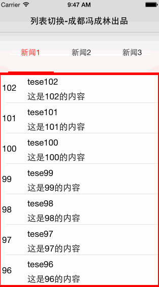
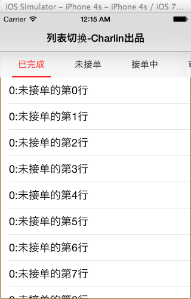
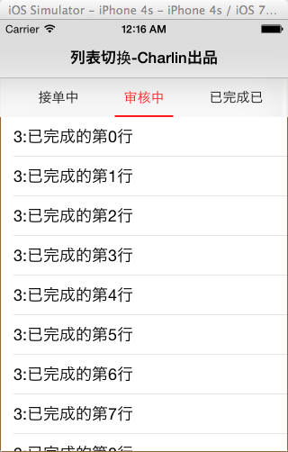
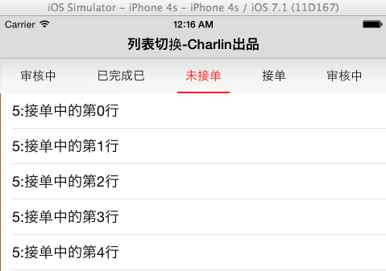
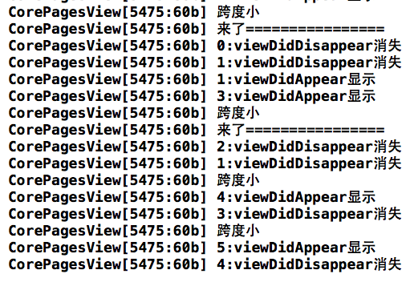

    Charlin出框架的目标：简单、易用、实用、高度封装、绝对解耦！

# CorePagesView
    列表滚动视图，性能王者！
 
  

组织信息 Charlin Feng：
===============
 
#### 特别群：请西部省市朋友实名加入组织。其他地区朋友请添加2-4群：谢谢。
 
【西部区域】西部大开发群号： 473185026  -追赶北上广！为振兴西部IT而努力！ 
热烈欢迎中国西部各省市的从事iOS开发朋友实名进群！本群为是聚集西部零散开发者，大家齐心协力共进退！   

【全国可加】四群： 347446259 
新开，可加！欢迎全国朋友加入组织   

【全国可加】三群： 474377358 
新开，可加！欢迎全国朋友加入组织   

【全国可加】二群： 369870753 
可加  

【全国可加】一群：163865401 
已爆满，加不上了  

  

框架截图 SHOW
===============
  
 

 

框架升级1.2版本 NEW FEATURE!
===============

####框架特性： 
>1.去除了宏定义配置，因为宏定义是全局的，我项目中遇到了不同的页面需要不同的配置，
所以页面参数配置变成了Model配置，更加灵活。 
>2.根据要求修复了右滑动越界崩溃的bug。 
>3.根据要求添加了代码动态设置页码，增加了相应的API 
>4.处理了用户疯狂点击顶部按钮因为复用机制导致的bug。 

1.0版本使用说明 USAGE
===============

框架说明 EXPALIN
===============
    .本框架主要是为了解决类似以下界面的而生：
    .网易新闻列表
    .越狱版的同步推（没越狱的没用过，不知道是不是一样的）
    .还有我自己做的项目如铁路wifi，车联网都使用到了这样的界面
    .等等，这种需求非常常见。
    大概的界面是：一个页面需要左右滑动，切换子控制器，同时顶部有tab标题，点击也可以滑动到对应的页面。
    
    
 
框架由来 FROM
===============
为什么要写这个框架，感觉功能不是很多啊？ 
首先要说的是这个需求其实是非常复杂的，我写的这个框架有上千行代码，里面有很多细节是需要注意的 
2.1 子控制器的数量不是固定的，这个需求有3个，下一个需求有4个。甚至网易新闻那种可定制化菜单，数量是不确定的。  
2.2 由于数量不确定，所以对整个需求加大了难度，同时如果像网易那种，有十来个子控制器，如果你敢一个全部加载，只能引发内存问题，我之前做了一个项目叫铁路wifi，有8个新闻栏目同时加载，在iphone 4上面直接卡死8秒左右才有反应。  
2.3 你仔细观察网易新闻，你会发现当点击tab切换，3分钟左右会触发新闻列表页面的刷新，当然这个新闻页面的刷新绝对不是本框架去关心的，这个是属性CoreList类型的加载框架应该做的事情，换句话说，为了解耦，你点击切换tab，只有在一种情况下才能触发，那就是触发子控制器的生命周期方法如viewDidAppear:和viewDidDisappear:,同时也涉及性能问题，我们需要动态添加和移除子视图。这个也是比较复杂的。同时添加和移除需要考虑很多问题，如子列表的位置，比如移除前子列表是一个tableView显示在第20行，移除添加之后最好还是在这个位置，给人一种没有动过的感觉。  
2.4 对于顶部的菜单来说，也有很多种样式，有的是一个按钮就很宽的，有的是图片加文字，有的是居中但是不是很宽，所以这些都是可以封装的，同时也是可以自定义修改的。  
2.5 scrollView的滚动切换与点击tab的切换是逻辑的，是可以封装的，同时如果顶部菜单数量过多，还需要动态调整让当前显示在中间。这些都是可以封装起来的。  
2.6 需要考虑屏幕旋转及横竖屏的问题。  
    
项目解析 USAGE
===============
    本框架写了一周左右（我正在做车联网，写框架的时间不是很多），写框架的时间考虑的问题还是算比较全面，
    下面就对如果自定义出你想要的样式，核心思想、重要代码以及使用做出一个解释。  
    
    使用示例：
    
    1.集成
        
    -(CorePagesView *)pagesView{
    
        if(_pagesView==nil){
            
            NewsListTVC *tvc1 = [[NewsListTVC alloc] init];
            NewsListTVC *tvc2 = [[NewsListTVC alloc] init];
            NewsListTVC *tvc3 = [[NewsListTVC alloc] init];
            NewsListTVC *tvc4 = [[NewsListTVC alloc] init];
            
            
            CorePageModel *model1=[CorePageModel model:tvc1 pageBarName:@"新闻1"];
            CorePageModel *model2=[CorePageModel model:tvc2 pageBarName:@"新闻2"];
            CorePageModel *model3=[CorePageModel model:tvc3 pageBarName:@"新闻3"];
            CorePageModel *model4=[CorePageModel model:tvc4 pageBarName:@"新闻4"];
            
            
            NSArray *pageModels=@[model1,model2,model3,model4];
            
        
            //自定义配置。如果传nil，则为默认值（全局有效）
            CorePagesViewConfig *config = [[CorePagesViewConfig alloc] init];
            config.isBarBtnUseCustomWidth = YES;
            config.barViewH = 80;
            
    
            _pagesView=[CorePagesView viewWithOwnerVC:self pageModels:pageModels config:config];

        }
        
        return _pagesView;
    }
    
    
    2.代码跳转：
    /** 中转到指定页码 */
    -(void)jumpToPage:(NSUInteger)jumpPage;
    
    
    
    
    
####.效果图片 
  
  
  
  

  

-----
    CorePagesView 列表滚动视图，性能王者！
-----

  
